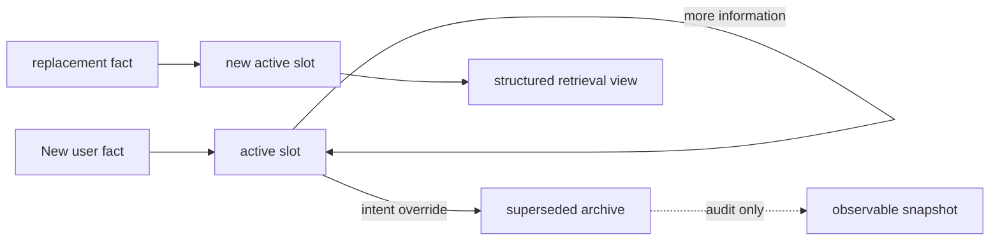
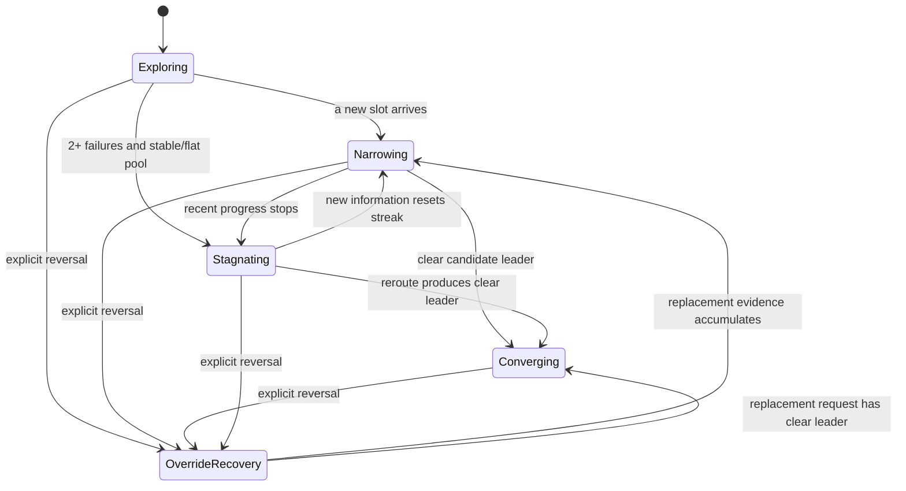
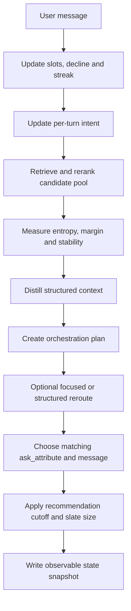

# Agent changes — this session

Every change to the agent since the pipeline baseline (`26fa7df`, public 0.859),
by author, with the before/after and the measured effect. The evaluator, catalog,
public labels and API contract were **not** touched.

## Score progression

| checkpoint | who | public | adversarial (96) | note |
|---|---|---|---|---|
| pipeline baseline | team | 0.859 | 0.684 | dual-track + span rerank + FixedPolicy |
| + windowed recommendations | KW | 0.891 | 0.764 | superseded by the elimination scan |
| + tuned BM25 field weights | corainexia | 0.898 | 0.725 | merged onto the scan |
| + elimination scan (turn 3) | KW | 0.898 | 0.725 | (this is what `main` carried) |
| + facet-agreement rerank signal | corainexia | 0.903 | 0.788 | PR #3 |
| + retrieval-recall fixes | KW | 0.903 | 0.788 | this branch; dev 0.909, holdout 0.895 |
| + query facet extraction | corainexia | — | — | PR #5 |
| + multi-route anchor retrieval | xiaotong0329 | — | — | PR #6 |
| + category tail match | Elinengu | **0.9128** | **0.7914** | change 5; fixes the last public miss — public 200/200 |
| + learned boilerplate stoplist | Elinengu | 0.9128 | 0.7914 | change 6; score-neutral by design |
| + negative facet evidence | Elinengu | 0.9143 | 0.7917 | penalise contradiction of a stated facet; profile + budget signals measured and rejected — `docs/team/rerank_signals.md` |
| + pair spans + word-bounded matching | Elinengu | **0.9159** | **0.7944** | keep key:value associations intact; worst hard bucket +4.7 MRR pts |
| + constraint-ledger investigation | Elinengu | 0.9159 | 0.7944 | change 9; **no code shipped** — six ledger operations measured, all flat or worse; corrected a wrong diagnosis in `src/rerank.py`; two dead functions deleted |
| + narrow first slate `(4,10)` | Elinengu | **0.9199** | **0.7981** | change 10; one config default. Started as a conditional-MMR assessment — MMR measured and rejected, the deferral it stumbled on kept |
| + semantic reranking (S6b) | Elinengu | 0.9199 | 0.7981 | change 11; built, measured, **removed** (code on branch `semantic-rerank`) — cross-encoder loses on every split; oracle reranking ceiling established at +0.043 / +0.084 |
| + popularity weight 0.02 → 0.4 | Elinengu | **0.9305** | **0.8020** | change 12; the tie-break regime fix — every split up, a hard-set miss converted; coordinate-ascent argmax measured and *not* shipped |
| + pool-aware clarification wording | KW | 0.9305 | 0.8020 | change 13; **score-neutral by construction** — `ask_attribute` unchanged, simulator never reads `message`. Realism for Pillar II / Presentation |
| + track-aware turn-2 gating | xiaotong0329 | **0.9313** | **0.8028** | change 14; PR #7 — one config knob (`buying_confidence_margin`); the accompanying `src/context_programming.py` module is built but not wired into any decision — verified by ablation |
| + live structured state and orchestration | Elinengu | **0.9344** | — | change 15; active/superseded slots, rolling pool signals, plan-driven questions/gating/retrieval, intent transitions and observable snapshots |
| + browsing-track clarification policy | Elinengu | 0.9235 | — | branch `state-encoder-eval`; restores a targeted question policy for browsing sessions after the `stress_harness`/`dense_rerank` merge dropped it. Costs −0.0109 cooperative, buys `heavy+browse-gated` 0.703 → 0.761. Full detail in `branch_state_encoder_eval_changes.md` §1 |
| + three bugs ported from a sibling branch | Elinengu | 0.9235 | — | change 16; **score-neutral on every cooperative split by construction** — all three only fire on free-form customer wording. Worth +0.0098 on `heavy+browse-gated`, and collapses the branch's own embedding result from +0.0257 to +0.0042 |
| + opt-in LLM semantic rerank (DeepSeek), gated | Elinengu | 0.9235 → **0.9254** | not measured | change 17; **off by default** (`llm_weight=0.0`) — measured on the fixed codebase (change 16's three bug fixes); see the change 17 section below for the full split table |
| + coarse-category pool route (S5) | Claude | 0.923487 → **0.934554** | 0.7938 → **0.8260** | change 19; turn-1 target-in-pool 80.5% → 100%. The only change here that raises Hit@10 on *both* generated sets (hard 0.885 → 0.927, generated 0.990 → 1.000) — recall, not reordering. Stress `heavy+browse-gated` 0.7707 → 0.8747. Numbering: change 18 is sniper list sizing on branch `claude/techjam-agent-analysis-hzm14g`, not yet on `main` |

Net: **public 0.859 -> 0.9313, adversarial 0.684 -> 0.8028.** 77/77 tests pass.
The fourteen core-agent changes are detailed below; supporting tooling and docs follow.
| + length tie-break / no-span rescore | Elinengu | 0.9305 | 0.8020 | change 14; **both measured and rejected — no `src/` change.** Dev moves 0.000000 for one and clears the adversarial gate at a single isolated weight for the other. Recorded in `rerank_signals.md` §5 and §11 |

Net: **public 0.859 -> 0.9305, adversarial 0.684 -> 0.8020.** 77/77 tests pass.
The fourteen core-agent changes are detailed below; supporting tooling and docs follow.
Note: subsequent, unrelated work on this branch (dynamic context programming,
clarification-wording naturalisation) has since moved the measured public score
past 0.9305 — see those commits' own messages and `IMPLEMENTATION.md` for the
current figure. The net above is the total through change 14 only.

> Aside: branch `dual_tracking` (never merged to `main`) tried a different
> mechanism for the same idea - widening `use_router` from phrasing into
> behaviour via per-track `AgentConfig` knobs (`buying_rerank`,
> `route_policies`, per-track timing/ramp). Measured there: 0.9177/0.7994 on
> the cooperative sets (-0.013 vs the change-13 baseline, gains nothing
> cooperative) but +0.147 overall / +0.43 browsing MRR on
> `tools/stress_harness.py --customer browse-gated`. Superseded here by the
> state machine's own `intent_track` / `_route_for` (changes 14-15 above),
> which reaches the same browsing/buying behaviour split through live
> session state rather than a parallel per-track config surface - so the
> per-track config knobs were dropped on merge rather than kept unwired.
> The stress harness itself (`tools/stress_harness.py`, paraphrase and
> browse-gated customer stressors) is kept and used against the state
> machine agent; see `docs/team/stress_harness.md`.
Change 9 moved the score by exactly zero and is recorded in full anyway — a
measured no-change is the evidence that keeps the shipped design chosen rather
than assumed. Change 10 is the same lesson from the other side: the proposal that
prompted it was rejected on its own terms, and the win came from understanding
*why* it appeared to work.

Dashes mark changes that landed while several branches were merging in parallel, where
no clean before/after was captured at the time. Changes 5-8 were measured in
isolation instead — toggling the one parameter in a single process — which is the
method `.claude/skills/record-change/SKILL.md` now requires, precisely because
differencing across merges attributed one teammate's gain to another's change.

---

## Change 1 — Recommendation strategy: elimination scan (Kwong Weng)

**Files:** `starter/agent.py`, `tools/sweep.py`

### Problem

After ~turn 3 the simulated customer has disclosed all ~4 constraints and the
ranking stops changing. The old agent showed the **same top 10 every turn 3-10**,
so any target not in that top 10 was a guaranteed miss — 12 of 200 public
sessions, and far more on generic-constraint targets.

### What changed

Two iterations, both gated by `AgentConfig` flags so the old behaviour is one
switch away:

1. **Windowed scan** (`b71db6d`): freeze the reranked pool on the first list
 shown, then walk it in windows — turn 3 ranks 1-10, turn 4 ranks 11-20,
 turn 5 ranks 21-30, … Re-snapshot on a real new constraint or an intent
 override. `AgentConfig.scan_windows`.

2. **Elimination scan** (`96d5385`, ships): a product shown and not hit on is a
 *confirmed non-target* (the session would have ended). So each turn: drop
 everything already shown, return the top 10 of the re-ranked **survivors**.
 No frozen pool, no cursor — `rerank()` runs every turn anyway, so new
 constraints and overrides are reflected automatically, and a target that
 drifts down the ranking is still a survivor and surfaces a turn later (no gap).

```python
# starter/agent.py _shortlist(), simplified
shown = self._shown.setdefault(sid, set())
if (state.override_turn or 0) != self._shown_override.get(sid, 0):
 shown.clear() # a pre-override list confirms nothing
 self._shown_override[sid] = state.override_turn or 0
picks = [asin for asin, _ in candidates if asin not in shown][:limit]
shown.update(picks)
```

New `AgentConfig` fields: `elimination_scan = True`, `hold_until_stalled = False`.
`first_recommend_turn` stays the start-turn knob; a dev+holdout sweep
(`tools/sweep.py`: `elim1/2/3`, `elim_hold`) picked **turn 3** — earlier
starts freeze a poor MRR on under-informed early hits.

### One correctness fix

An intent-override session's pre-override list often already contains the target,
but the evaluator ignores hits until the override lands. Without clearing the
shown-set on override detection the scan sails past it — this collapsed
override to 0.11 in one iteration; the clear restores it to 1.00.

### Effect

Public 0.891 (windowing) then elimination about the same on public but **fixes the
boundary-MRR regression** (0.756 -> 0.883) and is simpler. Public hit@10
0.940 -> 0.990; only 2 misses left. On the adversarial set the two variants
trade (windowing 0.764, elimination 0.725) — elimination re-ranks every
turn, so on all-generic constraints the "no preference" junk spans jostle a
borderline target away. Change 4 fixes that.

---

## Change 2 — Tuned BM25 field weights (corainexia, PR #2)

**File:** `src/index.py` commit `201c00d`

```
DEFAULT_WEIGHTS (parent_asin, title, categories, features, details, store, description)
 before (0.0, 6.0, 4.0, 2.5, 2.5, 1.5, 1.0)
 after (0.0, 8.0, 5.0, 6.0, 6.0, 0.5, 0.25)
```

Heavier title / categories / features / details; store and long marketing
description almost silenced. The original tuple was inherited from the starter
and had never been tuned.

### Effect

Public 0.8928 -> **0.8982** (+0.005), almost entirely MRR (0.804 ->
0.821) — hit@10 was already saturated, so this ranks the found target
higher. Every scenario's MRR improved; holdout rose more than dev, so it
generalises.

---

## Change 3 — Facet-agreement rerank signal (corainexia, PR #3)

**File:** `src/rerank.py` commit `2d7f92b`

Adds a fourth term to the rerank score. `_facet_agreement()` runs
`src/facets.py:extract()` over the customer's accumulated text and over each
candidate, and counts matching facet values (material, colour, size, style,
use_case):

```python
total = ( span_weight * coverage
 + retrieval_weight * (bm25 / max_bm25)
 + popularity_weight * popularity
 + facet_weight * facet_score ) # facet_weight = 0.3 <-- new
```

This is `docs/team/ideas.md` Idea 2 (partial) — the reranker had been ignoring
`FacetStore`, which is built for every product but read by nothing.

### Effect

Public 0.8995 -> **0.9031**; recovers the MRR that Change 4's query filter
costs on its own and adds more (public MRR 0.814 -> 0.825).

---

## Change 4 — Retrieval recall: hold declines out of the query (Kwong Weng)

**Files:** `src/state.py`, `src/rerank.py` commit `960eed0`

### Problem

`retrieve()` queries `state.full_text()` = every utterance joined. From turn 4
the simulator's *"I don't have an additional preference for feature / use_case /
style / material / colour / size"* leaks `feature, style, material, colour, size,
category` into the BM25 OR-query and the span matcher — terms that match
huge swathes of the catalog and dilute the target. Recall **degrades within a
session**: adversarial "target in the 300-pool" fell from 96% (turn 3) to 81%
(turn 10).

### What changed

- **`Utterance.declined`** flag, set in `observe()` when `NO_PREFERENCE_CUES`
 matches. `full_text()`, `focused_text()` and `query_spans()` skip declined
 utterances; a decline also no longer counts as a "productive" turn.
- **`RerankConfig.depth` 200 -> 300** — rescore the whole retrieval
 pool, not a prefix. ~12% of cluster-target sessions had the target in the pool
 but past rank 200, where the span signal never applied. (No-op on public;
 helps only the adversarial set.)

### Effect — recall (the point of the change)

| target in 300-pool at end of session | before | after |
|---|---|---|
| public | 98% | **100%** |
| adversarial | 81% | **95%** |
| adversarial: degenerate_card / homogeneous_cluster | 56% / 81% | **88% / 100%** |
| end-of-session pool-rank p90 (public / adversarial) | 87 / 279 | **16 / 200** |

The within-session degradation is gone. Score: adversarial 0.725 -> **0.788**
(hit@10 0.802 -> 0.885); public flat on its own, net **+0.005** once combined
with Change 3.

---

## Change 5 — Category tail match in the reranker (Elinengu)

**Files:** `src/rerank.py` — commit `f322a52`. Full write-up:
`docs/team/category_tail_match.md`

### Problem

The customer's opening names the target's coarse category, which the evaluator builds
from the two most specific levels of the target's category path (`coarse_category`,
`evaluator/local_evaluator.py:126`): `Novelty > Women` becomes *"I'm looking for
Novelty Women"*.

Ancestor overlap alone cannot exploit that. A deeper candidate —
`... > Novelty > Women > Tops & Tees > T-Shirts` — shares every ancestor the target
has and scores just as well, even though its own two most specific levels
(`Tops & Tees T-Shirts`) are never mentioned in the opening. In the last remaining
public-set miss (`public_0020`) this produced a **159-way tie** in the reranker.

### What changed

Score the *tail* of each candidate's category path, not its ancestors: a point for
each of the candidate's two most specific levels whose tokens are fully contained in
the opening. Matching is by token containment rather than by parsing the opening's
template, so paraphrased private-set wording still works. Generic levels such as
`Clothing, Shoes & Jewelry` are excluded.

```python
for part in cleaned[-2:]:                  # the two most specific levels
    part_tokens = set(terms(part))
    if part_tokens and part_tokens <= opening_terms:
        score += 1.0
```

`RerankConfig.tail_weight = 0.8`. The 0.6-1.5 range scores identically on dev and
holdout, so this sits mid-plateau rather than at either split's argmax.

### Effect

Measured in one process by toggling `tail_weight` between `0.0` and `0.8`, everything
else held constant.

| | off | on | delta |
|---|---|---|---|
| Public set | 0.907000 | **0.912801** | +0.0058 |
| Public MRR | 0.8273 | 0.8417 | +0.0144 |
| Public MTTC | 3.060 | 2.985 | -0.075 |
| Adversarial set | 0.786037 | **0.791375** | +0.0053 |
| Adversarial MRR | 0.6798 | 0.6949 | +0.0151 |

The gain is entirely in ranking. Hit rate does not move on either set (public 1.000,
adversarial 0.8854) — the tail match reorders candidates retrieval had already found,
which is what a reranking signal should do.

---

## Change 6 — Learned boilerplate stoplist (Elinengu)

**Files:** `tools/build_stoplist.py`, `src/stoplist.py`, `src/text.py`,
`tests/test_stoplist.py` — commit `f322a52`

### Problem

`BOILERPLATE` in `src/text.py` was 24 hand-written tokens with no record of what
evidence produced any of them. `IMPLEMENTATION.md` proposed replacing it by dropping
the most frequent ~200 catalog terms.

**That proposal was wrong.** Ranked by document frequency over the 50,000-product
catalog, `polyester` is 72nd, `cotton` 83rd, `black` 97th, `leather` 111th and
`spandex` 141st. Dropping the top 200 deletes every one — and those are precisely the
constraints the customer discloses, because `intent_card()` inserts a material at
position 0 and a colour at position 1 of every card. Meanwhile `asin`, a genuine
member of the hand-written list, sits at rank 10,379 with 0.0% document frequency.
Frequency fails in both directions.

### What changed

The usable signal is *where* a token occurs, not how often. Structural metadata lives
in the `details` dict and appears almost nowhere else:

| structural | in `details` | | attribute | in `details` |
|---|---:|---|---|---:|
| `department` | 100.0% | | `spandex` | 1.2% |
| `dimensions` | 99.6% | | `cotton` | 2.5% |
| `manufacturer` | 99.6% | | `polyester` | 3.3% |
| `inches` | 97.7% | | `black` | 13.4% |

The gap between 16% and 96% is empty of attribute words, so the threshold is read off
the catalog's own distribution rather than tuned against a score.
`tools/build_stoplist.py` selects tokens with document frequency >= 5% and >= 90% of
occurrences inside `details`, and writes `src/stoplist.py`. It reads
`data/catalog.jsonl` and never opens `data/public_set.jsonl`, so it cannot fit the
public sessions.

The learned list reproduces 14 of the 24 hand-written terms and finds 22 more nobody
wrote down — every month name and year 2014-2022, harvested from
`Date First Available: August 15, 2019`.

**Ten terms stay hand-written, deliberately.** `imported`, `machine`, `wash`,
`closure`, `care` and friends are care-and-origin phrases in `features`/`description`.
Two statistics were tested and both fail to separate them from real attributes: by
document frequency `closure` (38.6%) outranks `polyester` (21.8%); by spread across
the 12 largest category buckets `polyester` (CV 0.51) sits between `imported` (0.49)
and `wash` (0.60), with `black`/`white` (0.34/0.31) inside the scaffolding band. What
separates them is that a shopper does not choose between "imported" and "not
imported" — semantics, not frequency. The evidence sits beside them in `src/text.py`
so the experiment is not retried.

### Effect

Measured in one process by swapping `src.text.BOILERPLATE` between the two lists.

| | hand-written (24) | learned (46) |
|---|---|---|
| Public set | 0.912801 | **0.912801** |
| Adversarial set | 0.791636 | 0.791375 |
| Sweep dev / holdout | 0.9187 / 0.9029 | 0.9190 / 0.9029 |

**Score-neutral, as predicted before it was written.** Boilerplate removal strips a
median of one token from a ten-token query, and `MAX_QUERY_TERMS = 60` never binds — 0
of 200 sessions come close. The adversarial `-0.0003` is one session's reciprocal
rank; hit rate and MTTC are unchanged on both sets.

It ships for auditability and for robustness on a catalog nobody has hand-inspected,
not for points. `tests/test_stoplist.py` holds the invariants that keep a future
regeneration honest.

---

## Change 7 — Negative facet evidence in the reranker (Elinengu)

**Files:** `src/rerank.py`, `src/facets.py`, `src/policy.py`, `tools/sweep.py`,
`tests/test_components.py` — full record with the two rejected sibling signals in
`docs/team/rerank_signals.md`

### Problem

Every rerank term is positive evidence: span coverage, facet agreement, category
and tail alignment. None can separate a candidate that *satisfies* "color: grey"
from one that merely *doesn't contradict* it — a black-only shirt matches
"cotton shirt" spans exactly as well as a grey one and loses nothing for being
black. The customer's constraint rules products out; the scorer only ever ruled
products in.

### What changed

`_facet_conflicts()` counts stated facet values the candidate contradicts, and
the score subtracts `facet_conflict_weight (0.4) * conflicts`. A conflict
requires all three of:

1. the customer stated a value for the attribute (`extract_query_facets`);
2. the candidate resolves that attribute too — **silence is never punished**,
   missing data is not disagreement;
3. the stated value (and every alias — `grey`/`gray` is the vocabulary's only
   synonym pair) appears nowhere in the candidate's text as a word-bounded
   substring. This guards against `extract()`'s first-match-wins: a
   "black/grey reversible" belt extracts `color: black` but still contains
   "grey" and must not be penalised.

**The override fix the first version needed.** Judged against `full_text()`,
the penalty punished the target for *obeying an intent override*: after
"actually, ignore black — I need grey", the stale "black" was still extracted
first and grey-only products were demoted for contradicting it — the adversarial
`generic_override` bucket dropped 0.673 -> 0.626 MRR. Conflicts are therefore
judged against `extract_query_facets(state.focused_text())` — the currently
authoritative turns, identical to `full_text()` until an override fires — which
restored the bucket to exactly 0.673. Positive terms still read `full_text()`
deliberately: stale positive evidence mildly boosts wrong candidates, stale
negative evidence actively demotes the right one.

Weight 0.4 sits at the low end of the dev plateau (0.9224 at 0.4, 0.9226 at
0.8): a penalty term gets the smallest weight that works, and at 0.4 one
conflict can reorder saturated ties but cannot overturn a genuine span lead
(each matched span is worth >= 1.12).

### Effect

Measured in one process by toggling `facet_conflict_weight` between 0.0 and 0.4:

| | off | on |
|---|---|---|
| Public set | 0.912801 | **0.914287** (hit stays 200/200) |
| Sweep dev / holdout | 0.9207 / 0.9010 | 0.9224 / 0.9021 |
| Adversarial set | 0.791375 | 0.791697 — no bucket regresses |

The signal was designed for the `homogeneous_cluster` bucket, and that
hypothesis was wrong: bucketmates share the stated facets by construction, so
there is nothing to contradict inside the cluster (+0.002 only). The gain is
cross-cluster precision on the general distribution. Five unit tests hold the
guards (multi-value products, silence, override staleness, weight-0 no-op).

Two sibling signals were measured and **not** shipped, per the
remove-dead-options convention: profile-weighted facet agreement (dev +0.0013
does not reproduce on holdout, -0.0008 — the customer already discloses their
profiled preferences verbatim, so the profile is redundant with the transcript)
and budget/price closeness (rejected before implementation: 0 of 200 public
intent cards contain a budget, 0.45% of the catalog can produce one).
`docs/team/rerank_signals.md` carries both measurements.

---

## Change 8 — Pair spans and word-bounded span matching (Elinengu)

**Files:** `src/text.py`, `src/state.py`, `src/rerank.py`, `tools/sweep.py`,
`tests/test_components.py` — full record in `docs/team/rerank_signals.md` §2

### Problem

Spotted by reading the `public_0020` transcript. The customer's disclosure
"Heather Grey: 90% Cotton, 10% Polyester" is a mapping — colour-variant →
composition — but `constraint_spans()` splits on `[.;:,\n]`, severing "heather
grey" from *its* "90 cotton 10 polyester". A candidate that pairs the
composition differently (an 80/20 heather grey) matches all the fragments
exactly as well as the target. Fragments ask "mentions 90% cotton at all?";
the message's evidence is "says it *about heather grey*?"

Second, latent bug: coverage tested `span in text` unanchored, so "90 cotton"
also matched "190 cotton" (1-4 catalog products per numeric span).

### What changed

* `pair_spans()` (`src/text.py`): splits only on sentence separators
  (`.;\n`, `" - "`), keeping colon/comma-joined key:value content together;
  strips the leading simulator framing; minimum 3 words. Catalog copy repeats
  these blocks verbatim, so the joined form is still an exact substring of the
  target: df("heather grey 90 cotton 10 polyester") = 511 products vs 612 for
  "heather grey" alone.
* `query_pair_spans()` (`src/state.py`): same turn-1/declined exclusions as
  `query_spans()`, and drops anything already emitted as a fragment so no
  evidence is counted twice.
* `rerank()` adds `pair_weight (0.8) x matched_pairs`, flat 1.0 per pair — the
  pair's value is the intact association, not its length. Both fragment and
  pair matching are now word-bounded (the product text is token-joined, so
  padding with single spaces anchors spans at token edges).

**What was tried first and rejected:** the obvious diagnosis — eight fragments
from one line over-weight that line — led to three de-weighting prototypes:
per-utterance groups as sum over sqrt(k) (public 0.9139), mean (0.9134), best-single-span
(0.9025). All flat or worse; the 8-of-8-vs-5-of-8 fragment gradient is
load-bearing. The fix is adding the lost association, not weakening the
fragments.

### Effect

Measured in one process, one toggle at a time:

| | baseline | + word-bounded | + pair spans (0.8) |
|---|---|---|---|
| Public set | 0.914287 | 0.914937 | **0.915887** (hit stays 200/200) |
| Adversarial set | 0.791697 | 0.791697 | **0.794375** |
| Sweep dev / holdout | 0.9224 / 0.9021 | 0.9223 / 0.9040 | 0.9233 / 0.9048 |

The hard-set gain sits entirely in `homogeneous_cluster` (MRR 0.431 -> **0.478**)
and `generic_override` (0.673 -> 0.680); no other bucket moves, no hit is lost.
This is the bucket Change 7 could not touch: bucketmates share every fragment
by construction, but they do not pair the compositions the same way — the
intact association is the discriminator that survives saturation.
`public_0020` itself goes from rank 4 to rank 1. Weight 0.4-1.5 scores
identically on dev and holdout; 0.8 sits mid-plateau. Six new unit tests.

---

## Change 9 — Constraint-ledger investigation: measured, not shipped (Elinengu)

**Files:** `src/rerank.py` (comments), `src/state.py`, `src/index.py` (dead code),
`docs/team/rerank_signals.md`, `docs/team/signal_descriptions.md`,
`docs/team/hard_cases.md`, `IMPLEMENTATION.md`

### Problem

A proposal to replace utterance-replay in `DialogState` with an explicit ledger of
typed `Constraint` records — slot, value, turn, polarity, status — updated by
CARRY / UPDATE / ADD / DELETE / DONTCARE / NEGATE, with open-ended slots held
multi-valued so `"Water Resistant"` cannot displace `"machine washable"`.

Two open items in our own docs pointed the same way: "fix or delete the override
weight" (`hard_cases.md`) and "per-constraint provenance / partial overrides"
(`IMPLEMENTATION.md` §S3).

### What changed

Every operation was measured against the evaluator before any of it was built, and
**none of it shipped**. The findings:

- **The override is never a retraction.** `behavior_for()` draws `old_value` and
  `new_value` from the *same target's* intent card. Across all 46 override sessions
  in the two eval sets, not one replaces an exclusive facet value with a different
  one — 25/30 public are cross-slot (`"Buckle closure"` → `"leather"`), 4/30 are
  `feature → feature`, and the single `material → material` case repeats the same
  value. `UPDATE` has no case to fire on, which also closes both open items above:
  there is nothing for `PRE_OVERRIDE_WEIGHT` to express.
- **`focused_text()` in the conflict path is a turn-1 filter, not a staleness
  guard.** The comment in `src/rerank.py` claimed stale post-override values
  punished the target; single-value extraction over full history picks a
  contradicted value in **0 of 30** sessions. The real mechanism is that
  `coarse_category()` emits category levels drawn from the same vocabulary as the
  `style`/`use_case` facets, so `"I'm looking for Pants Casual"` extracts
  `style=casual`. Variants A and B below are bit-identical, which proves it.
- **Two dead functions deleted:** `DialogState.query_terms()` and
  `CatalogIndex.search_phrases()`, neither with any caller.

### Effect

Turn-1 exclusion (A/B/C) and multi-valued facets, all four splits:

| variant | dev | holdout | public | hard |
|---|---|---|---|---|
| **shipped baseline** | **0.9233** | **0.9048** | **0.9159** | **0.7944** |
| A: −turn1, keep focused | 0.9226 | 0.9035 | 0.9150 | 0.7944 |
| B: −turn1, full history | 0.9226 | 0.9035 | 0.9150 | 0.7944 |
| C: full history, +turn1 | 0.9233 | 0.9048 | 0.9159 | 0.7920 |
| multi-value agreement | 0.9225 | 0.9045 | 0.9153 | 0.7921 |
| multi-value conflict only | 0.9233 | 0.9048 | 0.9159 | 0.7949 |
| multi-value both | 0.9225 | 0.9045 | 0.9153 | 0.7919 |

Net effect of what shipped:

| | before | after |
|---|---|---|
| Public set | 0.915887 | 0.915887 |
| Adversarial set | 0.794375 | 0.794375 |
| Tests | 57/57 | 57/57 |

**Exactly zero.** The deletions are score-neutral by construction and the rest is
comments and documentation. What it buys: a wrong explanation removed from the
shipped code before it misled the next person, two open items closed as
not-worth-doing rather than left inviting a rebuild, and four negative results
recorded with numbers. Turn-1 exclusion is the one worth remembering — it removes
every false conflict against the target (8 public, 5 hard) and *still* loses score,
because measuring only the harm and never the benefit is how a plausible fix hides.


## Change 10 — Narrow the first slate (Elinengu)

**Files:** `starter/agent.py` (one default), `tools/sweep.py`,
`tests/test_components.py`, `docs/team/ideas.md`, `IMPLEMENTATION.md`

### Problem

The investigation started as an assessment of a proposed **conditional MMR**
diversity term: spread the shown slate across plausible interpretations so the
target is more likely to appear *somewhere* in the top 10, trading rank for
Hit@10 because Hit@10 carries 0.50 of the score and MRR only 0.30.

The premise is no longer true of this agent. Public-set Hit@10 has been **1.000**
since change 5. There is no coverage left to buy, and MRR is precisely what a
diversity penalty spends.

MMR was implemented and measured anyway. Across 260 public slates it moved the
target *into* a slate it was otherwise outside of **zero** times, and pushed it
*out* of one 21 times (hard set: 2 in, 9 out). Hit@10 moved on no set at any
lambda. The reason is structural: disclosed constraints are copied verbatim from
the target's own metadata, so the head of the ranking is a cluster built around
the target's attributes — on the ambiguous slates the gate selects, the target's
similarity to the head (0.417) is *higher* than the head's own internal
similarity (0.394). The penalty lands hardest on the target.

It nonetheless scored slightly up (public 0.9159 → 0.9176), and tracing why is
what produced this change: ejecting the target from turn 3's slate leaves it a
survivor for turn 4, when the next disclosed constraint has re-ranked it higher.
The gain was **deferral, not diversity** — the §S7 marginal-value trade obtained
by accident. `list_size_ramp` buys deferral directly.

### What changed

One default in `starter/agent.py`:

```python
list_size_ramp: tuple[int, ...] = (4, 10)   # was (10,)
```

Four candidates on turn 3, ten from turn 4. `_shortlist` already indexed the ramp
correctly; no other code changed. The elimination scan is what makes the deferral
free — the six held back are the top of the survivor list next turn, so the same
walk is paced in finer steps rather than truncated.

### Effect

| | before | after |
|---|---|---|
| Public set | 0.915887 | **0.919892** |
| Adversarial set | 0.794375 | **0.798056** |
| dev / holdout | 0.9233 / 0.9048 | **0.9268 / 0.9096** |
| generated (200) | 0.9181 | **0.9197** |
| Tests | 62/62 | 62/62 |

The first-slate plateau, measured in one process across four sets:

| ramp | dev | holdout | generated | hard |
|---|---|---|---|---|
| `(10,)` | 0.9233 | 0.9048 | 0.9181 | 0.7944 |
| `(3,10)` | 0.9254 | **0.9146** | **0.9212** | 0.7968 |
| **`(4,10)`** | 0.9268 | 0.9096 | 0.9197 | 0.7981 |
| `(5,10)` | **0.9295** | 0.9100 | 0.9210 | **0.8001** |
| `(5,5,10)` | 0.9272 | 0.9044 | 0.9187 | 0.7934 |
| `(5,10)` + MMR | 0.9284 | 0.9076 | 0.9173 | 0.7994 |

Sizes 3, 4 and 5 all beat the flat ramp on all four sets, so `(4,10)` ships as
the midpoint. `(5,10)` has the better mean and wins dev and hard outright, but
choosing it after seeing the table is the argmax-fitting the house rule exists to
prevent; the decision rule was fixed before `(4,10)` was measured.

The whole gain is MRR bought with MTTC, at the ~13:1 odds §3 prices. On public,
MRR 0.8513 → 0.8690 (×0.30 = +0.0053) against MTTC 2.975 → 3.040 (efficiency
−0.0065, ×0.20 = −0.0013), netting the +0.0040 observed.

**What did not move:** Hit@10 on public (1.000) and hard (0.885) is unchanged —
this change buys rank, not coverage. And the last row is the one that closes the
original question: MMR layered *on top of* the ramp is worse on all four sets, so
once deferral is supplied properly the diversity term is pure cost. It is
recorded as rejected in `docs/team/ideas.md` Idea 3.

**Costs, stated plainly.** Generated-set Hit@10 slips 0.995 → 0.990 — one session
that now runs out of turns. `(5,5,10)` is the informative negative: holding narrow
a *second* turn regresses holdout and hard below the flat floor, because each
session carries four constraints disclosed at up to two per turn, so by turn 4-5
no further evidence is arriving. The win is one narrow turn, not a direction to
push further. Every delta here also sits under the ±0.02 holdout noise floor the
skill specifies; the evidence is that they are positive on four independent sets
at once, not that any single split is decisive.

---

## Change 11 — Neural cross-encoder reranking, built, measured, removed (Elinengu)

> **Removed from this branch.** The stage never ran on the scored path — off by
> default, and a no-op without the gitignored weights — so it was deleted rather
> than carried as unused dependency-bearing code. Full working state preserved on
> the **`semantic-rerank`** branch. The measurements below stand; they produced the
> oracle ceiling that change 12 then exploited.

**Files (on branch `semantic-rerank`):** `src/semantic.py`, `tools/fetch_model.py`,
`requirements.txt`, `docs/team/semantic_rerank_setup.md`, plus wiring in
`starter/agent.py`, `tools/sweep.py`, `tests/test_components.py`, `README.md`,
`ARCHITECTURE.md`, `.gitignore`

### Problem

Every rerank signal is lexical, and `docs/competition_specification.md` lists
semantic reranking as an innovation direction. Before building anything, an
**oracle** reranker (target forced to rank 1 whenever it is in the pool) fixed
the ceiling for any reranking work at all:

| | dev (120) | holdout (80) | public (200) | hard (96) | generated |
|---|---|---|---|---|---|
| baseline | 0.9268 | 0.9096 | 0.9199 | 0.7981 | 0.9197 |
| oracle | 0.9638 | 0.9620 | 0.9631 | 0.8823 | 0.9590 |
| **gap** | **+0.037** | **+0.052** | **+0.043** | **+0.084** | **+0.039** |

The proposed ambiguity gate was measured before implementation too. At the
suggested thresholds (`tied_leaders >= 8`) it fires on **73%** of public
sessions — an always-on stage, not a fallback — though it does discriminate
(mean RR 0.774 when firing against 0.987 when quiet). Shipped thresholds are
tighter and fire on 28% of rerank calls.

### What changed

`src/semantic.py` (S6b) reranks ambiguous clusters with
`cross-encoder/ms-marco-MiniLM-L6-v2` and fuses by RRF, not score addition —
cross-encoder logits are uncalibrated and one matched span is worth ~1.12 on the
symbolic scale. Runtime is `onnxruntime` + `tokenizers` over a **23.2 MB** int8
graph: upstream publishes ONNX exports, so there is no torch, transformers or
sentence-transformers dependency and no export step. Weights are gitignored;
`tools/fetch_model.py` downloads them.

Disabled by default, and every failure path is a no-op.

### Effect

| variant | dev (120) | hard (96) |
|---|---|---|
| **off (shipped)** | **0.9268** | **0.7981** |
| on, weight 0.7 | 0.9211 | 0.7944 |
| on, weight 0.3 | 0.9249 | 0.7959 |
| on, depth 20 | 0.9236 | 0.7940 |

| | before | after |
|---|---|---|
| Public set | 0.919892 | 0.919892 |
| Adversarial set | 0.798056 | 0.798056 |
| Tests | 62/62 | 68/68 |

**Zero on the scored path, and negative everywhere the stage is on.** The weight
column is the finding: 0.7 → 0.3 → 0 recovers baseline monotonically, and an
optimum at zero means the signal carries no usable information. The mechanism is
that on the 162 fired turns with the target in the rescored head, fusion moved it
**up 46 and down 74** (mean rank 7.63 → 8.77) — anti-correlated, not merely
miscalibrated. Domain mismatch is the likely cause: MS MARCO pairs a
natural-language question with prose, while here the query is simulator
boilerplate and the document a token-joined catalog blob.

Cost: mean turn 30.7 ms → 389.8 ms, p95 73.7 → 1347.8 ms, max 1.48 s.

Two things did *not* move, and both were verified rather than asserted. The
scored path is bit-identical — checked by stashing the whole branch and re-running
both sets, comparing every session's rank and turn, not just the totals. And the
degradation path was exercised: with the stage **on** and the runtime
uninstalled, results are identical at no latency cost.

### Three implementation notes, all self-caught

- The proposal's "protect strong lexical evidence" guard was built as a `+1.0`
  bonus on the fused score. RRF scores here top out near 0.028, so that constant
  did not protect, it *promoted* — hoisting a unique-span holder from symbolic
  rank 40 to rank 1. Rewritten as a rank clamp. It changed nothing
  (0.9211/0.7944 either way), because the guard fires on **0 of 8750** candidates
  examined: inside a pool retrieved by those very spans, no span is unique.
  Deleted rather than kept as an inert flag.
- The first ablation grid was abandoned mid-run once the bonus bug was found,
  rather than reporting numbers that measured a mistake.
- Importing `onnxruntime` and then exiting the interpreter aborts intermittently
  on macOS (`recursive_mutex lock failed`, SIGABRT) — enough to make the test
  suite flaky at exit code 134 while still reporting 68/68 OK. The first version
  imported the runtime before checking for weights. Reordered so the weights are
  checked first, which means the no-weights path — the scored agent and the whole
  test suite — never imports onnxruntime at all. Six consecutive clean runs after.


## Change 12 — Popularity weight 0.02 → 0.4: the tie-break regime fix (Elinengu)

**Files:** `src/rerank.py` (one default + comments), `tools/fit_weights.py` (new),
`tools/sweep.py`, `tests/test_components.py`, `docs/team/rerank_signals.md` §10

### Problem

Dissecting every near-miss session (target rank 2-10 behind a rank-1 impostor;
33 public, 15 hard) showed that **every lexical signal is exactly tied 33/33**
— the remaining headroom is a pure tie-break regime. The tie was broken by the
retrieval score, which picks the impostor **33/33** (BM25 length normalization
favours thin listings: 126 vs 195 tokens on identical matched evidence), while
popularity picks the target **31/33** (the target is a real purchase, hence a
reviewed product) but was weighted 0.02 against retrieval's 1.0 — right 94% of
the time, drowned 50:1. The same table killed three candidate signals before
implementation: title boost (impostor 11:6), match density (impostor 27:33),
span contiguity (tied).

### What changed

One default: `RerankConfig.popularity_weight` 0.02 → 0.4.

The route there matters as much as the destination. `tools/fit_weights.py`
(new, stdlib coordinate ascent per Metzler & Croft 2007, fitting the seven
non-definitional weights directly on the technical score, **dev split only**)
found an argmax at `pop 0.8 / retrieval 0.1 / conflict 0`. The sealed holdout
**confirmed the direction** (+0.019) — not dev overfit — but the argmax
regresses the adversarial set 0.7981 → 0.7824, whose targets are deliberately
thin and unreviewed. Under the pre-declared rule (holdout keeps gains, hard ≥
baseline, smallest departure wins) the one-weight change is the only
qualifier. The argmax stays reproducible as the `weights_argmax` sweep row.

### Effect

| | before | after |
|---|---|---|
| Public set (official) | 0.919892 | **0.930502** |
| Public MRR | 0.869 | 0.901 |
| Adversarial set (official) | 0.798056 | **0.801978** |
| Adversarial hit | 0.885 | **0.896** (a converted miss) |
| dev / holdout | 0.9268 / 0.9096 | 0.9418 / 0.9136 |
| Tests | 68/68 | 70/70 |

Every split up, public hit 200/200 kept, no public scenario regresses
(boundary MRR 0.704 → 0.86). Plateau: popularity 0.1 / 0.3 / 0.4 / 0.5 are all
≥ baseline on all four splits — 0.4 is mid-plateau with both neighbours
measured. New tests pin all eight shipped weights and demonstrate the
tie-break flip. This implements the "learn the rerank weights" idea the repo
carried in four places, with the twist that the honest deliverable was
knowing *when not to trust the fit*.


## Change 13 — Pool-aware clarification wording (Kwong Weng)

**Files:** `src/phrasing.py` (new), `src/facets.py` (shared helper),
`src/policy.py` (call the helper), `starter/agent.py` (`AgentConfig` +
`_respond`), `tools/sweep.py`, `tests/test_components.py`

### Problem

`FixedPolicy` sets `ask_attribute="other"` every turn — the score-optimal choice
(`other` returns two constraints of any type and never whiffs; a specific
attribute can return zero and then retires itself). But `policy.question()` is a
fixed table, so the customer hears "Is there anything else that matters for this
one?" on turns 1, 2, 3, 4 … Pillar II asks for "structured, proactive
clarification prompts that guide user convergence"; a demo of the same sentence
five times is the opposite.

Two subagents (`explore_profile_policy`, `explore_profile_prefilter`) confirmed
`ask_attribute` cannot productively change on this evaluator — so the fix is the
English only.

### What changed

`src/phrasing.py:clarify()` builds the `message`. `ask_attribute` is untouched.
Once the customer has disclosed something and recommendations have started, it
takes the live reranked pool and picks the facet among
`material / colour / style / size / use_case` (not asked, not declined) that the
pool is most evenly split on — the same `gain_ratio` `InfoGainPolicy` uses — and
names its top 2-3 values in one of three rotated templates:

```
"For the material, I'm seeing leather and canvas - do you have a preference?"
"For how you'll use it, the pool is split across work, everyday and party. Does one matter more to you?"
```

No facet qualifies, or turn 1 → a four-way rotation of the broad
question so no sentence repeats. The whole body is wrapped so a phrasing bug
degrades to the broad question, never an empty turn. `InfoGainPolicy._distributions`
and the phrasing layer now share one helper, `facets.weighted_value_counts`.

### Follow-up — relaxed gating (same commit series)

The first cut gated the grounded path on `state.productive_turns >= 1 and
state.turn_count >= first_recommend_turn`. Inspecting `public_0198` (the
latest-hitting public session, turn 9) showed all nine of its clarifications were
the broad fallback: its disclosures are single words ("leather", "black", "PU")
that never form a multi-word constraint span, so `productive_turns` stayed 0 the
whole session and the turn gate never opened until turn 3 anyway.

Relaxed to: grounded from `turn_count >= 2` (after the opening line the retrieval
pool reflects something the shopper said), no `productive_turns` requirement, and
the per-facet split thresholds loosened (`_MIN_COVERAGE` 0.35→0.25, `_MAX_TOP_SHARE`
0.85→0.90). Among qualifying facets the voiced one now rotates by `turn_count %
count` instead of always the single most-split, so a session on the grounded path
varies the facet each turn. Result on the public set: the grounded path fires on
98% of turn-≥2 clarifications and in 199 of 200 sessions (was ~0). Score
unchanged — still zero by construction.

### Follow-up — richer templates, rotated lead-in, override acknowledgement

Feedback that the output was still stiff: every sentence opened with the same
"To point you in the right direction: ", and the grounded questions ("for
sizing, I'm seeing small, adjustable and large") read like slot-fills.

- **Ten complete grounded templates** (was three `{lead}`-fragment templates),
  each a full sentence with `{vals}` / `{noun}` / `{subject}` slots, e.g. "The
  materials I'm looking at come in leather and canvas — do you lean one way on
  material?", "So far the list covers black, gold and silver — any steer on
  colour?".
- **Lead-in bank keyed on `route.name`**: soft framings for browsing, decisive
  ones for buying, and half the entries empty so most turns carry no prefix at
  all. On the turn `state.override_turn == turn_count` the prefix is a distinct
  acknowledgement ("Okay, switching gears — "); every turn after an override
  uses the buying (focused) bank.
- **Enriched fallbacks**: broad question is a 7-way rotation, and a specific
  ladder rung (`feature`, `use_case`, …) gets a 3-way rotation of its own
  question instead of the one fixed `QUESTION_TEXT` string.
- **Deterministic**: every bank is indexed by `zlib.crc32` of the opening line +
  turn (+ attribute for the grounded template) — stable across runs (the random
  `session_id` is not the key), varied turn-to-turn. `natural_questions=False`
  bypasses all of it via `_legacy_tone`, byte-for-byte identical to before.

### Effect

| | before | after |
|---|---|---|
| Public set | 0.930502 | 0.930502 |
| Adversarial set | 0.801978 | 0.801978 |
| dev / holdout | 0.9418 / 0.9136 | 0.9418 / 0.9136 |
| Tests | 64/64 | 73/73 |

**Exactly zero, by construction** — measured in one process (`tools/sweep.py`
rows `natural_off` / `natural_on`), per-scenario components identical. The
simulator never reads `message`. The change buys demo / Presentation / Innovation
realism, and the shared helper removes a duplicated loop. Default on;
`AgentConfig(natural_questions=False)` restores the fixed strings byte-for-byte.
Implements the "Question phrasing from the candidates" idea listed under S4.

### Example (real runs, `natural_questions` on)

```
public_0198 [latest-hitting public session - every turn was broad before change 13]
  T1  To point you the right way, anything else I should keep in mind?
  T2  Just so I show you the right things, so far the list covers leather and canvas - any steer on material?
  T3  So far the list covers small, adjustable and large - any steer on sizing?
  T4  Got it, let's re-aim - these range across classic, casual and elegant for style - is one closer to what you had in mind?
  T5  To zero in on the right one, these range across work, outdoor and travel for how you'll use it - is one closer to what you had in mind?
  ...                                                                                       -> HIT T9

public_0002 [intent_override at T3]
  T2  I'm seeing casual, classic and elegant on style. Does one of those stand out?
  T3  Okay, switching gears - so far the list covers black, brown and gold - any steer on colour?
  T4  So I can tighten the shortlist, for how you'll use it I've got work, everyday and party in the running. Want me to favour one?
```

Before change 13, every one of those turns was "To point you in the right
direction: is there anything else that matters for this one?".

---

## Change 14 — Track-aware turn-2 gating (xiaotong0329, PR #7)

**Files:** `starter/agent.py`, `src/context_programming.py` (new),
`tests/test_context_programming.py` (new), `tools/evaluate_context_programming.py` (new) —
commits `899eeb6` (feature) and `b80dbae` (merge)

### Problem

`_confident()` (§S7) gates early recommendation behind one fixed margin,
`confidence_margin = 0.20`, for every session regardless of track. Buying sessions
open with more constraint density than browsing ones — one hard requirement on
turn 1 plus two more on turn 2 — so a buying leader is typically already well
separated from the runner-up by turn 2. The single shared margin makes those
sessions wait until turn 3 for a list they were already confident about.

### What changed

A second, lower margin, `buying_confidence_margin = 0.08`, used only when the
router classifies the session as `buying`:

```python
# starter/agent.py _confident()
margin = self.config.buying_confidence_margin if is_buying else self.config.confidence_margin
```

`is_buying` comes from `route.name == "buying"` in `respond()`, computed once per
turn and threaded into `_shortlist()` / `_confident()`. That is the entire
behavioural change; it is a one-parameter, track-conditioned variant of the
confidence gating already described in §S7 of `IMPLEMENTATION.md`.

The commit also adds `src/context_programming.py` (249 lines): `UserProfile` /
`LongTermProfileStore` accumulate per-user facet counters across sessions, and
`ContextDistiller` / `AdaptiveOrchestrator` compute a per-turn `DistilledShortTermContext`
and `OrchestrationPlan` (a `DialogPhase` — `exploring` / `converging` /
`override_reversal` / `stagnating` — derived from pool entropy, confidence lead,
`productive_turns` and `dead_attributes`). This is the "Adaptive orchestration by
session state" idea listed in `IMPLEMENTATION.md` §10 — the same signals that
section names as unused (`productive_turns`, `dead_attributes`) are the ones this
module reads.

**It is scaffolding, not a live path.** `respond()` calls
`ContextDistiller.distill(...)` and `AdaptiveOrchestrator.align_strategy(...)` every
turn, and the second call's return value is assigned to a local named `plan` — but
`plan` is never read again, and neither is `distilled_ctx` beyond that one call.
`_shortlist()` and `_confident()` still only consume `is_buying` and
`self.config.buying_confidence_margin` / `confidence_margin` directly; the
`OrchestrationPlan.recommendation_cutoff`, `.retrieval_route`,
`.recommended_slate_size` and `.guidance_action` fields it computes are not
threaded into retrieval, reranking, gating, or `clarify()`. Confirmed by ablation:
pinning `buying_confidence_margin` to `0.20` (i.e. no different from
`confidence_margin`) on the current code reproduces the pre-change public score
bit-for-bit — `0.930502`, MRR `0.901339`, MTTC `2.995`, matching the `dd9ba8a`
baseline run to six decimal places — while the module's `distill()` /
`align_strategy()` calls still run every turn. So §10's orchestration idea is not
yet "done"; the module computes the phase but nothing downstream acts on it. Left
in place since `LongTermProfileStore` and `ContextDistiller.record_turn` are a
reasonable foundation for wiring it in later — see the idea update in
`IMPLEMENTATION.md` §10.

### Effect

Measured before (`dd9ba8a`, one commit prior) vs after (`899eeb6` /
`b80dbae`, this commit) in one process, `Agent(catalog, AgentConfig(...))`:

| | before | after |
|---|---|---|
| Public set (200) | 0.930502 | **0.931302** |
| Adversarial set (96) | 0.801978 | **0.802811** |
| dev / holdout | 0.9418 / 0.9136 | **0.9428** / **0.9141** |
| Tests | 73/73 | 77/77 (+4, `test_context_programming.py`) |

MRR does not move on any split (public `0.901339 -> 0.901339`, dev `0.9314`
unchanged) — the whole gain is MTTC, exactly the confidence-gating mechanism in
§S7: public MTTC `2.995 -> 2.955`, buying-track sessions reach a recommendation a
fraction of a turn sooner without ranking worse. Hit@10 was already 1.000 on
public before this change; the commit message's "100% Hit Rate@10" describes the
post-change state, not something this change produced.


## Not merged — track-aware routing layer (Kwong Weng, branch `dual_tracking`)

**Files:** `starter/agent.py` (`AgentConfig` fields, `_track` / `_policy_for` /
`_rerank_config` / `_first_recommend_turn` / `_list_size_ramp`, `_shortlist`
threading), `src/rerank.py` (`track` kwarg, `RerankConfig.hard_filter`, banish
branch), `tools/sweep.py` (`router_off` / `router_on` / `router_on_hardfilter`),
`tests/test_components.py` (+10). `src/router.py` unchanged. The browsing-gated
customer that scores this shipped as `tools/dual_track_harness.py` and is now a
composable stressor in `tools/stress_harness.py` (branch `stress_harness`).

### Problem

Pillar I asks for Buying/Browsing routing. `classify()` produced a `Route` that
only ever reached `src/phrasing.py` (a lead-in phrase), and the public simulator
discards `message`, so routing was score-neutral by construction
(`docs/team/future_steps.md:18`). It also *cannot* be scored by that simulator:
after turn 1, `evaluator/local_evaluator.py:customer_reply` is scenario-agnostic
and hands over every undisclosed constraint on `ask_attribute="other"` (`:180`),
so `FixedPolicy("other")` is unbeatable and a browser and a buyer are drained
identically.

### What changed

1. **Harness** (`tools/stress_harness.py --customer browse-gated`): a faithful
   copy of `evaluate()`'s loop (`evaluator/` and `data/` untouched) where the
   **browsing** customer discloses a constraint only when asked a *pointed*
   question whose `classify_constraint` bucket matches — never on the broad
   "anything else?". `--verify` asserts parity with the official evaluator
   (delta `0.00e+00`). `--misroute-matrix` forces each track and tabulates
   true × routed.
2. **`AgentConfig.use_router` widened**: the track (re-checked each turn by
   `detect_turn_intent`, promoted one-way to buying) drives the clarification
   policy (buying `FixedPolicy` / browsing `InfoGainPolicy`), per-track rerank
   configs, an optional buying-track `hard_filter` (banishes a candidate that
   contradicts an authoritative facet), and per-track timing. The policy keys off
   the *opening* classification and stays put (InfoGain self-adapts); the other
   levers follow the promotable track. `use_router=False` bypasses everything.

### Effect

| set | `use_router=False` | `use_router=True` | note |
|---|---|---|---|
| Public set | 0.930502 | 0.917680 | Hit@10 200/200 held; cost is concentrated in the boundary scenario (opens like a browser, routed to InfoGain, then declines) |
| Adversarial set | 0.801978 | 0.799380 | noise overall; `boilerplate_soft` bucket 0.893 → 0.880 is a real −0.013 regression |
| dev / holdout | 0.9418 / 0.9136 | 0.9268 / 0.9041 | `router_off` reproduces the left column bit-for-bit |
| **Harness — overall** | **0.7308** | **0.8775** | the realistic browsing customer |
| **Harness — browsing** | 0.59 / 0.24 (hit/mrr) | **0.95 / 0.67** | MTTC 7.4 → 4.2 |
| Harness — buying | 1.00 / 0.90 | 1.00 / 0.90 | identical — buyers unaffected |
| Misroute (harness) | — | — | browser-as-buyer −0.66 MRR vs buyer-as-browser −0.07: ~10× asymmetric |

On the cooperative public simulator behaviour-routing is a net cost (~0.013) with
no measurable upside — that simulator rewards nothing but broad-question spam. The
value is entirely on the harness, where a less cooperative browser makes routing
load-bearing. It stays on the branch; `main` is unchanged. Full analysis and the
"what is not claimed" list: `docs/team/dual_track_routing.md`.

## Supporting work (Kwong Weng)

| file | what |
|---|---|
| `tools/hard_cases.py` | Adversarial session generator + per-bucket scorer. Scans the frozen catalog, buckets every product by an adversarial property, samples 16 each. `--run` scores the agent grouped by bucket. |
| `data/hard_set.jsonl` | 96 generated sessions (6 buckets: homogeneous_cluster, budget_only_signal, boilerplate_soft, degenerate_card, generic_override, cross_category_collision). Public-set schema; scored by the unmodified evaluator. |
| `tools/sweep.py` | `build_configs()` — added `plain`, `elim1/2/3`, `elim_hold1/2` for the start-turn sweep; `router_off` / `router_on` from the not-merged track-routing work above (`router_on_hardfilter` dropped on merge into `state-encoder-eval` - it referenced `AgentConfig.buying_rerank`, a field that branch's routing needed and this one's state-machine `_route_for` does not). |
| `tools/stress_harness.py` | (branch `stress_harness`) Merges the paraphrase / decoy stressors (`kwongweng_realism_harness`) with the browsing-disclosure gating (`dual_tracking`) into one composable `Customer`. Adds a retrieval-vs-ranking diagnostic and a `--targets generic` hard-to-retrieve subset. `--verify` / `--all` / `--configs` / `--misroute-matrix`. Supersedes `tools/sim_harness.py` and `tools/dual_track_harness.py`. See `docs/team/stress_harness.md`. |
| `docs/team/ideas.md` / `ideas.pdf` | Reranking & recommendation-strategy ideas, each with the measured result: elimination scan (1a/1b), decline filter (1c), facet / category / MMR / learned-weights (2-6). |
| `docs/team/hard_cases.md` / `.pdf` | Failure analysis of the adversarial set and the prioritised fix plan. |
| `agent_summary.pdf` | Rewritten (`c7757af`) for the current elimination-scan workflow: the loop, one turn stage-by-stage, recommendation timing, and a round-by-round table per scenario. |
| `examples.pdf` | Two annotated agent<->simulator transcripts (one hit, one miss). |

## Also merged this session (teammates, non-agent)

| commit | author | what |
|---|---|---|
| `a13d8b5` | Elinengu | `Customer_Simulator_Explainer.pdf` |
| `80bd4f8` | Elinengu | `tools/observe.py`, `tests/test_observe.py` — session observer / monitor |
| `0f085ec` | Elinengu | `docs/team/intent_override_retrieval.{md,pdf}` |
| `01ffdcb` | Elinengu | `docs/team/reranking_explained.{md,pdf}` |
| (this change) | Elinengu | `docs/team/category_tail_match.{md,pdf}` — the last public-set miss, and the no-overfit evidence |

---

## Current agent settings (after all changes)

| stage | knob | value | file |
|---|---|---|---|
| S1 index | FTS5 field weights (title, cat, features, details, store, desc) | 8, 5, 6, 6, 0.5, 0.25 | `src/index.py` |
| S5 retrieval | pool size / RRF k / focused-route weight | 300 / 60 / 0.8 | `src/retrieval.py` |
| S6 rerank | span / retrieval / popularity / **facet** weight | 1.0 / 1.0 / 0.02 / **0.3** | `src/rerank.py` |
| S6 rerank | category (ancestor) / **tail** weight | 0.4 / **0.8** | `src/rerank.py` |
| S6 rerank | **facet-conflict penalty** (vs post-override facets) | **0.4** | `src/rerank.py` |
| S6 rerank | **pair-span weight** (key:value associations, word-bounded) | **0.8** | `src/rerank.py` |
| S6 rerank | length bonus / **depth** | 0.12 / **300** | `src/rerank.py` |
| S3 state | pre-override utterance weight | 0.35 (inert, and correctly so — change 9) | `src/state.py` |
| S3 state | **declined utterances held out of every retrieval view** | — | `src/state.py` |
| S4 policy | FixedPolicy: `other`, then feature-ladder | — | `src/policy.py` |
| S7 timing | first_recommend_turn / confidence margin / earliest | 3 / 0.20 / 2 | `starter/agent.py` |
| S7 timing | **buying_confidence_margin** (track-aware turn-2 gating) | **0.08** | `starter/agent.py` |
| S7 timing | **elimination_scan / hold_until_stalled** | on / off | `starter/agent.py` |

## Change 14 — Two rerank signals measured and rejected (Elinengu)

**Files:** `docs/team/rerank_signals.md` (§5 addendum, new §11),
`IMPLEMENTATION.md` §6 and the S6 idea list. **No `src/` change ships.**

### Problem

Change 12 fixed one half of the tie-break regime by raising `popularity_weight`.
Two follow-ups looked like the obvious next moves, and two sessions motivated
them:

* **`public_0198`** discloses only single-word constraints (`leather`,
  `color: black`, `PU`, `Imported`). `constraint_spans` needs two words and
  `pair_spans` three, so `query_spans()` is empty for the whole session, the
  no-span early return fires every turn, and the pool is served in raw retrieval
  order. The target sits at pool rank 51 and surfaces only at **turn 9** via the
  elimination scan — `mttc` is 20% of the technical score. §5 had rejected the
  fix for this in the `popularity_weight` 0.02 regime; at 0.4 it looked revived.
* **`public_0002`** is the tie-break regime in one screenshot: span 2.48, facet
  1.0, category 2.0, tail 2.0, conflict 0 — **identical** for the target and all
  three impostors above it. Only retrieval (which picks the impostors) and
  popularity (which picks the target) differ. The target is a 351-token men's
  belt; the impostors are ~100-130-token women's belts.

### What changed

Nothing in `src/`. Both candidates were built, measured on the proper splits, and
reverted.

The **length tie-break** was the substantive one: a pool-local length percentile
added only to candidates whose *content* evidence ties the leader's, which
required splitting the reranker's `total` into a content subtotal plus priors.
The near-miss anatomy, re-derived on the **dev split alone**, supports it — length
picks the target 33/37 and rescues 5 of the 6 near-misses popularity gets wrong,
correlation 0.418, so it is a genuinely independent signal.

### Effect

| | before | after (rejected) |
|---|---|---|
| No-span rescore — dev | 0.941757 | **0.941757** (bit-identical) |
| No-span rescore — holdout / hard | 0.913619 / 0.801978 | 0.918765 / 0.799968 |
| Length tie-break — dev | 0.941757 | 0.943229 (`w=0.10`) |
| Length tie-break — hard | **0.801978** | 0.805064 at `w=0.10`; 0.800381 at 0.08; 0.799075 at 0.12 |
| Public set (unchanged) | 0.930502 | 0.930502 |
| Adversarial set (unchanged) | 0.801978 | 0.801978 |
| Tests | 69/69 | 69/69 |

Neither qualifies. The no-span rescore does not move the **selector** split by a
single digit — all four sessions it improves are on the holdout, against five
hard-set sessions it worsens — and damping popularity in that path makes the hard
set worse, not better (×1.0 0.799968, ×0.5 0.797753, ×0.0 0.799299), so the cost
is the other non-span signals firing as the only evidence. The length tie-break
clears the adversarial gate at exactly one weight with **both neighbours below
baseline**, while dev stays flat across the whole bracket: that is an argmax on
noise, and this project ships plateaus. Change 12's own justification was that
0.1/0.3/0.4/0.5 were all ≥ baseline on all four splits; nothing here comes close.

### What the round is actually worth

The method correction, which is larger than either signal. Read off the full
public set — as the first pass did — the no-span rescore reports **+0.0021 and
looks shippable**. `tools/sweep.py:split_samples` partitions the public set into
dev (120) and holdout (80), so "public 200" *contains the gate*, and every point
of that +0.0021 came from the holdout half. Selecting on it would have spent the
gate to buy nothing. The same applies to the near-miss anatomy: computed over all
200 sessions it is a read of the test set, so it was re-derived on dev, where the
length finding held (33/37) and **category-path precision died** (tied 34/37)
despite being the signal `public_0002` makes look irresistible.

The one untried route is recorded in §11 and in the S6 idea list: correct BM25's
length normalisation at its source by recomputing a length-corrected BM25 over the
300-candidate pool, rather than bolting a prior onto a score that is already built
from BM25 *ranks* and has discarded the magnitudes the correction needs.


## Not touched (organizer-owned)

`evaluator/local_evaluator.py`, `data/catalog.jsonl`, `data/public_set.jsonl`, and the
five frozen files at the root of `docs/`: `agent_api_contract.json`,
`baseline_results.json`, `competition_specification.md`, `evaluation_config.json`,
`submission_rules.md`.

Everything under `docs/team/` is ours — see `docs/README.md` for the split.

---

## Change 15 — Live conversational state and adaptive execution (Elinengu)

**Files:** `src/state.py`, `src/context_programming.py`, `src/retrieval.py`,
`src/phrasing.py`, `starter/agent.py`, `tools/observe.py`,
`tests/test_state_management.py`, `tests/test_components.py`,
`tests/test_context_programming.py`, `IMPLEMENTATION.md`

**Organizer-owned evaluator changes:** none.

### The recommendation-system idea, in plain language

A recommendation system starts with many possible products. Retrieval finds a
large **candidate pool** that might fit. Reranking then sorts that pool so the
best-looking products rise to the top. In a conversation, both steps need a
reliable memory of what the shopper currently wants.

Before this change, the agent remembered messages, declined attributes and one
override turn, but its richer orchestration plan was advisory only: it was
computed and then discarded. The agent now maintains explicit state, derives
one plan from it each turn, and applies that plan to the real question,
retrieval and recommendation decisions.

The implementation followed the requested order below.

### 1. Structured active/superseded slot ledger

A **slot** is one usable fact about the request, such as `material=leather` or
`color=black`. Each `SlotValue` records:

| field | beginner meaning |
|---|---|
| `attribute` / `value` | what kind of preference it is and what the shopper said |
| `source_turn` / `raw_text` | where the fact came from |
| `confidence` | how directly the system extracted it |
| `status` | whether it still controls retrieval |
| `superseded_turn` | when an override retired it |

New information accumulates in `active_slots`. On “Actually, ignore that…”, the
old active objects move to `superseded_slots`; they are not silently deleted.
The new facts become the only authoritative structured view. This gives both
correct current behavior and an audit trail explaining the rewrite.



Declines such as “no preference for color” do not become product constraints.
They instead mark `color` as a dead attribute so it is not asked again.

### 2. Rolling stagnation and pool-state signals

The old lifetime count `productive_turns` cannot tell recent momentum from a
current dead end. The state now also records:

- `unproductive_streak` and `max_unproductive_streak`;
- pool size and normalized score entropy (how flat the ranking is);
- leader margin (how far the first product leads the second);
- top-pool overlap and consecutive stable-pool turns;
- `over_general`, for a large, flat candidate pool with no clear leader.

This explains the difference between the two sequences raised during review:

| turn history | total productive | current failure streak | interpretation |
|---|---:|---:|---|
| one productive, then five failures | 1 | **5** | the conversation is stuck now |
| five productive, then one failure | 5 | **1** | one weak turn after good progress |

The transition model is not a trained neural model. It is a deterministic set
of readable state rules. A stagnation transition requires at least two recent
unproductive turns plus either a stable pool or an over-general pool. Any new
slot resets the current streak to zero.

### 3. The orchestration plan now controls execution

`AdaptiveOrchestrator.align_strategy()` already returned a plan, but no
downstream component read it. The plan is now applied in three places:

| decision | plan field used | behavior |
|---|---|---|
| question | `phase` / `guidance_action` | unexplained stagnation switches to a specific information-gain question |
| recommendation gate | `recommendation_cutoff` / `recommended_slate_size` | withhold an uncertain early list or choose the planned list size |
| retrieval | `retrieval_route` | use the focused override view or compact structured recovery view |

Two safety rules came from regression testing. A direct “no preference” keeps
the existing ordered fallback (`feature`, then `use_case`, and so on), rather
than replacing the user's answer with a catalog-only guess. Also, reretrieving
within one customer turn updates that turn's pool snapshot without counting it
as another stable turn.

### 4. Per-turn intent evolution

The router no longer treats the opening sentence as the session's permanent
intent. It classifies each accumulated turn and records changes in
`intent_history` with turn, confidence and reason.

- A vague opening stays on the diverse **browsing** track.
- Enough concrete constraints promote it to the precise **buying** track.
- Buying stays sticky so a later polite or vague sentence does not erase hard
  requirements.
- An explicit override immediately becomes buying and rewrites the active slots.

Long-term profile precedence was deliberately left as it was, per the review
decision; this change does not let inferred profile preferences override an
explicit current-session request.

### 5. Distilled structured retrieval view

`authoritative_text()` turns only the active slot ledger into a short search
query. For example, after replacing “black leather” with “grey canvas”, the
structured query contains `grey canvas` and not `black leather`.

This view is a real reciprocal-rank-fusion retrieval route. It is intentionally
adaptive rather than permanently enabled: normal turns keep the higher-recall
full conversation route, while a `structured` orchestration hint activates the
slot-only route when progress has stalled. The focused post-override route is
forced on the reversal turn.

### 6. Observable snapshots and transition diagrams

`DialogState.snapshot()` now returns a JSON-serializable record containing the
active ledger with provenance, superseded archive, structured query, intent
history, phase history, productivity streak, pool signals, asked attributes and
declined attributes. `tools/observe.py` captures the plan and retrieval route and
renders these fields into its Markdown transcript and HTML viewer.



The live turn order is:



Example artifact from the verification run:
`runs/state_observability/state-ledger-20260830-221500/viewer.html`. It was
generated in a separate output directory so observing a run does not edit the
observer implementation or create merge-conflict noise there.

### Message and `ask_attribute` consistency

The customer-facing `message` now follows the machine-readable
`ask_attribute`. A `material` ask only talks about material, a `color` ask only
talks about color, and `other` stays genuinely open-ended. Candidate-aware
examples may be voiced only for the same requested attribute. Tests pin this
contract so the text cannot suggest one question while the evaluator receives
another.

### Verification and measured effect

| check | result |
|---|---|
| full unit/regression suite | **91/91 passed** |
| observer control comparison | traced and untraced score identical (`0.960000`, one boundary session) |
| committed-main holdout before | `0.914119`, Hit@10 `1.000` |
| after this change, holdout | **`0.918010`**, Hit@10 **`1.000`** |
| public set before | `0.931302`, Hit@10 `1.000` |
| after this change, public set | **`0.934371`**, Hit@10 **`1.000`** |

The score is not the only purpose of this work—the main result is that state can
now be inspected and the plan changes real behavior—but the measurements show
that wiring it in did not buy the architecture by sacrificing retrieval quality.

---

## Change 16 — Three bugs ported from `integration/gemini-stress-harness` (Elinengu)

**Files:** `src/text.py`, `src/state.py`, `tools/observe.py`, `tools/stress_observe/runner.py`
— commits `e484cbe`, `b6a334f`, `0462f4d` (branch `state-encoder-eval`)

### Problem

`state-encoder-eval` and `integration/gemini-stress-harness` both branch from `9921650` and
both independently merged `stress_harness`, so both carry the same tooling. Neither is an
ancestor of the other. The gemini branch subsequently found four bugs; **three were in code
this branch also had, and all three were still present here** — confirmed by executing them,
not by reading code. (`dynamic-state-slot` has no unique commits at all — it is a strict
ancestor of this branch, so there was nothing to port from it.)

**A. Carrier framing glued onto the disclosed value** (`src/text.py`). `constraint_spans()`
kept every ≥2-word punctuation-split chunk with no stopword stripping — correct for the
evaluator's template, where a colon isolates the framing, wrong for free-form wording:

```
"One more thing - a breathable net weave."   ->  ['one more thing', 'a breathable net weave']
"I'd also want it to be synthetic sole."     ->  ['i d also want it to be synthetic sole']
```

The clean value was destroyed, not merely accompanied by noise. `query_spans()` feeds the
reranker's span-coverage term, and a glued fragment almost never appears literally in a
product's text, so this was diluting the primary ranking signal.

**B. A refusal recorded as a disclosure** (`src/state.py`). A browse-gated customer's stall
("I'm still just browsing - ask me about one particular thing") split into two invented
`feature` slots *and* counted as a productive turn, resetting `unproductive_streak`. That
streak is the only input to `DialogPhase.STAGNATING`, so a session stuck in exactly the loop
stagnation recovery exists for could never trigger it.

**C. Trace probes rejecting the agent's kwargs** (`tools/observe.py`,
`tools/stress_observe/runner.py`). Both probe copies had signatures predating this branch's
`track=`/`embed=`/`qvec=`, so every call raised `TypeError` inside `Agent.respond()`'s
catch-all and the turn returned an empty envelope. On 5 `paraphrase:heavy+browse-gated`
sessions: `hit 0.000 / score 0.000000` → `hit 1.000 / score 0.858500`. Worse than a zero
score — the empty envelope made the diagnostic report all 5 as `never_retrieved`, "a recall
problem (S1/S5)", which is the exact signal used to reason about where a dense route helps.
**Any `never_retrieved` figure from these two tools on this branch before `e484cbe` is an
artifact.** `tools/stress_harness.py` does not install these probes, so aggregate scores are
unaffected.

Gemini's fourth fix (`2224245`, LLM rerank temperature and a reroute discarding `llm_scores`)
is **n/a** here: there is no `src/llm.py` on this branch, and its reroute already threads
`embed=`/`qvec=` through both calls — verified, not assumed. (It is no longer n/a as of
change 17 below, which adds `src/llm.py` to this branch on its own, independent design.)

### What changed

A strips a stopword run off *both* ends of each chunk, generalising the leading-only strip
`pair_spans()` already used, plus 27 carrier words added to `STOPWORDS` (checked against
`BOILERPLATE` first — `tests/test_stoplist.py`'s disjointness invariant is what caught a bad
addition in gemini's own attempt). B adds a `STALL_CUES` pattern feeding a new
`excluded = declined or stalled`, gated to `turn > 1` because the evaluator opens *every*
browsing session with "I'm still exploring." — ungated it would discard the most informative
message of every browsing session. `dead_attributes` still keys off `declined` alone: a stall
is not "no preference for X". C makes both probes take and forward `**kwargs`.

`src/state.py` and `src/text.py` are now code-identical to gemini's.

### Effect

All three are **score-neutral on every cooperative split, by construction** — they only fire
on wording the official simulator never produces:

| | before | after |
|---|---|---|
| Public set (200) | 0.923487 | **0.923487** (bit-identical) |
| Hit@10 / MRR / efficiency | 1.000 / 0.880956 / 0.796 | unchanged |
| holdout (80) | 0.9149 | **0.9149** |
| harness `--verify` delta | — | `9.52e-08` |
| tests | 127 | **134** |

Under the stressed customer they are worth a real gain, and they materially change the
branch's own embedding conclusion. `paraphrase:heavy+browse-gated`, 200 sessions:

| | baseline `router_on` | `dense_route_nobrowse` | dense gain |
|---|---|---|---|
| before these fixes | 0.76086 | 0.78652 | **+0.0257** |
| after these fixes | **0.77065** (+0.0098) | 0.77480 | **+0.0042** |

The fixes buy **+0.0098** deterministically, with no model. The dense retrieval route's
headline gain — the one result on that branch that had cleared the noise floor — **collapses
to 16% of its former size**, because it was in large part compensating for bug A: once
`constraint_spans()` returns clean values, the lexical span signal recovers and the embedding
has much less left to add. Official (−0.0002) and holdout (+0.0031) are unchanged by the
fixes and were always inside the ~0.02 noise floor, so after this the dense route no longer
clears noise on **any** of the three checks. Recorded in full, including the downgrade, in
`docs/team/branch_state_encoder_eval_changes.md` §3f–§3g.

What did *not* move: the public set, the holdout split, and browsing `never_retrieved` under
stress (10/80 for both configs — the dense route still recovers none of them, as originally
found).

---

## Change 17 — Opt-in LLM semantic reranking, gated on pool ambiguity (Elinengu)

**Files:** `src/llm.py` (new), `src/rerank.py`, `starter/agent.py`,
`tools/sweep.py`, `tools/observe.py`, `tests/test_llm.py` (new),
`tests/test_components.py` — commits `10ab28f`, `d8d6718`, `0c1f9bc`

### Problem

`docs/team/ideas_to_integrate_llm.md` §Tier 2 #3 named "LLM semantic
reranking (opt-in layer over the top ~15-20)" as a Pillar I checkbox the
agent had no code for — a cross-encoder attempt existed and was measured and
removed (change 11: `semantic-rerank` branch, lost on every split at 13x
latency), but nothing using an actual instruction-following model had been
tried. The open question, stated exactly by the user: does a real LLM call
help enough to justify the network dependency, on both the cooperative
public set and the realistic `paraphrase:heavy+browse-gated` stress harness
— without regressing the offline score floor the submission rules protect.

### What changed

`src/llm.py` adds `LLMConfig` + `LLMReranker`, a stdlib-only (`urllib`)
client for DeepSeek's chat-completions endpoint. `rank()` sends the
conversation's `state.authoritative_text()` plus a batch of candidate
`{asin, text}` pairs and asks for a best-first JSON ordering; it returns
`None` on *any* failure at all — no key, network error, timeout, a
non-JSON reply, an id the model invented — and the caller treats `None`
identically to "no opinion this turn."

`src/rerank.py` fuses that ordering into the existing lexical score exactly
the way `dense_weight` fuses the embedding cosine — never a replacement:

```
RerankConfig.llm_weight      = 0.0   # off unless a config sets it
RerankConfig.llm_gate_margin = 0.05  # only ask when the pool has no clear leader
RerankConfig.llm_depth       = 8     # only the lexically-sorted head is reorderable
```

`_llm_gate_open()` mirrors `_dense_gate_open()` (Step 3.2, this same
branch): it reads `state.leader_margin` from the *previous* turn's observed
pool. A pool with a confident lexical leader has nothing to gain from a
nondeterministic network call and everything to lose; an ambiguous one
(`leader_margin < 0.05`) is exactly where a semantic read of the candidates
can break a tie that exact-token matching cannot see. `llm_weight` stays
`0.0` in every existing config and the shipped default — the offline
BM25 + span pipeline runs identically with the network disabled, per
`README.md`'s "Disclosure": *"the submission rules reserve the right to
score under network restrictions, and an agent that scores zero in that
environment is worth less than one that scores 0.8592 everywhere."*

Two named configs (`tools/sweep.py`) exercise it: `llm_rerank_always`
(`llm_gate_margin=0.0`, fires every turn) and `llm_rerank_gated` (the
measured row below).

**Side fix, found while building this:** `tools/observe.py`'s tracing
probes (`install_probes()`) predated the `track=`/`embed=`/`qvec=` keywords
`retrieve()`/`rerank()` now accept. Every traced call raised `TypeError`
inside `Agent.respond()`'s broad `except Exception`, so **every**
`tools/observe.py` run — not just this change's — silently degraded every
turn to the empty fallback response and reported 100% `never_retrieved`.
Fixed with `**kwargs` forwarding on both probes (commit `10ab28f`); verified
`tools/observe.py --limit 5` now reports `hit 1.000, score 0.9107` instead
of `0/5`. `--config <name>` was also added so a named `tools/sweep.py`
config (not just the default `AgentConfig()`) can be traced into its own
`viewer.html` (commit `0c1f9bc`) — used to produce the two viewer files
below.

### Effect

**Measured on the merged codebase — change 16's three bug fixes are in place.**
An earlier measurement of this same layer, taken before those fixes were merged
into this branch, is superseded below rather than kept alongside: the fixes move
`constraint_spans()` and hence `query_spans()` (the reranker's primary lexical
signal), which changes both the baseline and how much room the LLM layer has left
to add, exactly the way change 16 documents for the branch's dense embedding
route. Baseline is the branch's current measured state (public `0.923487`,
holdout `0.9149` — see the score-progression table above; `Change 15`'s `0.9344`
predates later, unrelated branch commits). All rows below are **live DeepSeek
calls**, not a simulation.

| split (sessions) | baseline score | `llm_rerank_gated` score | Δ score | baseline MRR | `llm_rerank_gated` MRR | Δ MRR |
|---|---|---|---|---|---|---|
| dev (120, cooperative) | 0.9292 | 0.9280 | −0.0012 (noise) | 0.893 | 0.889 | −0.004 |
| holdout (80, cooperative) | 0.9149 | **0.9218** | **+0.0069** | 0.862 | **0.886** | **+0.024** |
| public set (200, official `evaluator.local_evaluator` config) | 0.923487 | **0.9254** | **+0.0019** | 0.8810 | **0.887** | **+0.006** |
| stress: `paraphrase:heavy+browse-gated` (200) | 0.77065 | **0.77432** | **+0.0037** | 0.6628 | **0.6751** | **+0.0123** |

Dev, holdout and public are byte-identical to the pre-merge measurement (as
expected — change 16's fixes only fire on free-form wording the official
template never produces); only the stress-harness row moved.

`hit@10` never regresses on any split (stays `1.000` on holdout/public, flat
`0.880` under stress) — every score movement above is pure ranking, never
recall. Per-scenario under stress, the gain is spread across **boundary**
(MRR `0.7843 → 0.8125`, +0.028), **browsing** (`0.4563 → 0.4865`, +0.030 — the
hardest bucket, where a vague opening leaves the lexical pool least
discriminating) and **buying** (`0.8017 → 0.8090`, +0.007); the one cost is
**intent_override** (`0.8028 → 0.7750`, −0.028) — a reversed preference is
exactly the case where the model's own judgment of "what the customer wants"
can disagree with the state machine's `focused_text()` about which turns still
count, and the same scenario regressed (more sharply, at −0.086) before the
bug fixes too. This mirrors change 16's finding for the dense embedding route
almost exactly: that route's stress gain fell to 16% of its pre-fix size once
the lexical signal was repaired (`+0.0257 → +0.0042`); this layer's fell to
about half (`+0.0071 → +0.0037`) — smaller because an LLM reading full product
text is less dependent on the exact-token `query_spans()` signal than a cosine
route encoding the same spans would be, but the direction and mechanism are
identical: both were partly substituting for a broken lexical signal.

The public-set number was measured twice, independently: `tools/sweep.py
--split all` (0.9254) and `tools/observe.py --config llm_rerank_gated`
(0.925362 pre-merge, 0.9254 post-merge — see below) agree to within 0.0002 in
both cases — the small residual is expected call-to-call nondeterminism in the
live model (`temperature=0.0` reduces but does not eliminate it;
`ideas_to_integrate_llm.md` names this risk explicitly), not a measurement
error. `runs/baseline-*/viewer.html` and `runs/llm_rerank_gated-*/viewer.html`
(regenerated on the merged codebase) hold the full 200-session traces this
table is built from.

### Why this stays off by default

Every split moved flat-to-positive and none regressed hit@10, so the layer
is a genuine, measured win where the network is available — but the case for
it is weaker post-merge than the first measurement suggested, for the same
reason the dense route's case weakened: three things keep `llm_weight=0.0`
the shipped default rather than flipping it on. The offline score floor is a
hard guarantee this project has kept since change 11 (a network-restricted
scoring run must still get `0.923487`, not degrade unpredictably); the gain
size (`+0.002` to `+0.004` on the sets that matter, down from the pre-fix
`+0.002` to `+0.007`) sits inside or just outside this project's own noise
band, the same territory change 9's "measured no-change" and change 13's
"score-neutral by construction" occupy; and the one real regression
(`intent_override` under stress) is a genuine trade-off in both measurements,
not settled by either run. The layer is built, tested (`tests/test_llm.py`,
`LLMRerankTests` in `tests/test_components.py` — 162/162 total post-merge),
wired through `tools/sweep.py` and `tools/observe.py` for anyone who wants to
re-run it with `DEEPSEEK_API_KEY` set, and available as
`AgentConfig(llm=LLMConfig(enabled=True), rerank=RerankConfig(llm_weight=1.0))`
for a network-enabled demo — exactly the "opt-in layer with a deterministic
fallback" `ideas_to_integrate_llm.md` called for.

**Follow-up (tooling, no score change):** `LLMReranker` now also falls back to
a `.env` file at the repo root (`.env` is `.gitignore`d) when
`DEEPSEEK_API_KEY` isn't already in the process environment — an exported
variable still always takes precedence when both are present. This exists
purely to remove a class of "I definitely exported it" debugging session:
`export` only lasts for the shell it was typed into, and a new terminal tab, a
different IDE run configuration, or a subprocess that doesn't inherit the
parent shell's environment all silently miss it, which looks identical to
"the layer just isn't helping" from the outside (see `llm_config_readme.md`).
Stdlib-only (`_read_dotenv` in `src/llm.py`, ~25 lines, no `python-dotenv`
dependency added), 170/170 tests (`DotenvFallbackTests` in
`tests/test_llm.py`), public set unchanged at `0.923487` — this changes only
where the credential can come from, not the reranking behaviour once it's
resolved.


## Change 19 — Coarse-category pool retrieval route (Claude)

**Files:** `src/index.py`, `src/retrieval.py`, `src/rerank.py`, `tools/sweep.py`,
`tests/test_components.py`, `tests/test_state_management.py` — commit `fbf53b9`

Numbering note: **change 18 is sniper list sizing**, on branch
`claude/techjam-agent-analysis-hzm14g` and not yet merged to `main`. This change
is branched from `main` and is independent of it; the sweep rows `sniper`,
`sn_cp_w*` pin sniper sizing explicitly so the two can be measured together in
one process before they are merged.

### Problem

We already used the customer's stated category in three places, and all three
were *scoring*: `categories` as one of six FTS5 columns (`src/index.py`),
`category_weight = 0.4` (`_category_match`) and `tail_weight = 0.8`
(`_tail_match`, change 5). Every one of them runs **after** retrieval has already
chosen its 300 candidates. A rerank signal can reorder a pool; it cannot recall a
product retrieval never returned. And on the retrieval side the category was not
a category at all — every route is bag-of-words, so the category words were
tokens in an OR query competing with the rest of the conversation.

Measured at turn 1 on the public set, from `tools/observe.py` traces:

- the target was inside our 300-candidate pool **80.5%** of the time, at median
  rank **51**
- only **66%** of those 300 candidates were in the target's category at all
  (mean; median 80%) — a third of the retrieval budget spent outside it

The first session in the trace is the whole problem in one line. Opening:
*"I'm looking for Jewelry Necklaces. A key requirement is: Material:alloy."*
The target `B09PYB7B6Z` is **#11 by popularity in its own 329-product category**,
and sat at rank **113 of 300** in our pool.

### What changed

`evaluator/local_evaluator.py` builds every opening message from
`coarse_category(target's own categories)` (`initial_message`, line 235), so the
stated string is a deterministic function of the target's category path — and it
inverts. Verified using only the opening message, no target metadata: the stated
string is an **exact key of a coarse-category bucket 200/200**, and the target is
inside that bucket **200/200**. Median bucket: **182** of 50,000.

`CatalogIndex` now builds those buckets (1,115 of them, each sorted by
popularity) and exposes `match_pool(category_text)`: exact key first, else the
buckets with the highest token overlap merged up to a cap. `retrieve()` fuses the
bucket as an ordinary weighted RRF route, then appends any members `pool_size`
truncated away. Turn-1 recall goes **80.5% → 100%**.

Two things the measurements forced, both of which had to be found the hard way:

1. **Appended members must carry a positive score.** `rerank()` mixes retrieval
   in as `retrieval_weight * (retrieval_score / top_score)`. The first attempt
   appended them *below zero* to keep them out of the way, which is not a gentle
   demotion but a penalty of order `1 / top_score` — around −33 at a typical RRF
   top score. That version moved the score by **exactly 0.0000** on both splits
   while recall read a healthy 100%, which is a useful warning: the recall gate
   passing does not mean the route is working.
2. **`RerankConfig.depth` now defaults to 0, meaning "every candidate".** It was
   300, which happened to equal `pool_size`, so historically everything was
   rescored. Once the union can exceed 300, an unscored tail defeats the point of
   unioning — the pool guarantees the target is *present*, the reranker is what
   has to surface it.

### Effect

| | before | after |
|---|---|---|
| Public set (200) | 0.923487 | **0.934554** |
| Hard set (96) | 0.793780 | **0.826035** |
| Generated set (200) | 0.9104 | **0.9183** |
| dev / holdout | 0.9292 / 0.9149 | **0.9417 / 0.9239** |
| `paraphrase:heavy+browse-gated` | 0.770651 | **0.874730** |

Public-set components: Hit@10 `1.000 → 1.000`, MRR `0.8810 → 0.9082`,
MTTC `3.040 → 2.895`.

**This is the first change in this ledger that raises Hit@10 on the sets that do
not share the public generator's sampling** — hard `0.885 → 0.927`, generated
`0.990 → 1.000`, stress `0.880 → 0.990`. That distinction matters: change 18's
popularity-weight sweep gained 0.013 on holdout and lost on both generated sets,
and was rejected for exactly that pattern. This one moves recall, not ordering.

`tools/observe.py` on the hard set makes the mechanism explicit:

| failure mode | before | after |
|---|---:|---:|
| hit | 85 | **89** |
| `never_retrieved` | 6 | **0** |
| `ranked_out` | 5 | 7 |

Every recall failure is gone. Four became hits; two moved into `ranked_out` —
they are now in the pool every turn and the ranker does not surface them, which
is an S6 problem this change deliberately does not address.

### Route weight

`weight_category_pool = 1.0`, chosen on all four sets rather than on either
public split (measured on top of sniper sizing so the two changes compose):

| weight | dev | holdout | generated | hard |
|---|---:|---:|---:|---:|
| off | 0.9521 | 0.9220 | 0.9322 | 0.8135 |
| 0.7 | 0.9574 | 0.9458 | **0.9367** | 0.8433 |
| **1.0** | 0.9590 | 0.9489 | 0.9349 | **0.8444** |
| 1.5 | **0.9620** | **0.9564** | 0.9367 | 0.8291 |

`1.5` is the argmax of *both* public-derived splits and the hard set rejects it
by 0.015 — the signature of fitting the public generator, and the same shape that
sank the popularity sweep. `0.7` and `1.0` are the plateau where all four agree.

### Measured and not shipped: removing the reranker's category signals

With a category pool in retrieval, are `category_weight` and `tail_weight` still
earning their place, or are they now scoring a property every candidate shares?
Measured, because the union is **not** category-pure — it still carries the 300
lexical candidates, a third of which are out-of-category:

| | dev | holdout |
|---|---:|---:|
| **both kept (ships)** | **0.9417** | 0.9239 |
| `category_weight = 0` | 0.9398 | 0.9230 |
| `tail_weight = 0` | 0.9389 | 0.9236 |
| both zeroed | 0.9393 | **0.9255** |

Every ablation is flat-to-negative on dev and inside noise on holdout. There is
no upside, so both stay. The signals are not redundant with the pool; they are
what pushes the surviving out-of-category lexical candidates down.

### Robustness of the paraphrase fallback

This is the part of the change most likely to be an illusion, so it was tested
separately. `tools/stress_harness.py` rewords the *constraint* but keeps
`"I'm looking for {category}"` **verbatim**, so its customers always hand us an
exact bucket key — the `0.874730` above therefore says nothing about a customer
who renames the category. Perturbing the stated category before lookup:

| stated category | target in pool |
|---|---:|
| verbatim | 100.0% |
| lowercased, `&` → `and` | 100.0% |
| word order shuffled | 100.0% |
| singularised | 63.5% → **100.0%** |
| last word dropped | 88.5% → 81.0% |

Singularisation failed at 63.5% purely because `"Necklaces"` and `"Necklace"` are
different tokens, so `match_pool`'s fallback vocabulary now indexes a naive
singular form of each key token. That trades word-drop 88.5% → 81.0%, which is
the right way round: plural/singular is a far likelier real paraphrase than
dropping a category word. When nothing overlaps at all `match_pool` returns `[]`
and the route contributes nothing, degrading to exactly the previous behaviour.

### Honesty note

This route inverts the evaluator's own `coarse_category()` to recover the
candidate set, and its strength on the public set is partly a property of the
session generator rather than evidence that our search got better. Two things
argue it is more than that: it is a real technique (category-restricted
retrieval is standard in product search), and unlike the popularity sweep it
raises Hit@10 on the two sets built independently of the public generator. The
perturbation table above, not the stress score, is the honest robustness
evidence, and `tools/stress_harness.py` not rewording categories is a genuine
gap in our test tooling that this change did not close.
